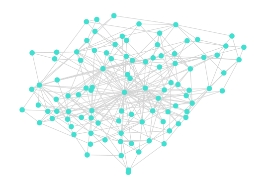

# ForceAtlas2.jl



A port of Gephi's *Force Atlas 2* layout algorithm to Julia(Graph).

## Installation
in Julia REPL, Pkg mode

```sh
add https://github.com/sudame/ForceAtlas2.jl
```

### Dependencies
- JuliaGraph
- GraphPlot (only for examples)

## Usage
See [examples](./example/)

```julia
using Graphs, GraphPlot, ForceAtlas2

g = random_regular_graph(100, 2)
locs_x, locs_y = forceatlas2_layout(g, 1000)

gplot(g, locs_x, locs_y)
```

If you prefer the default number of iterations (100 iterations), you can do as follow:

```julia
using Graphs, GraphPlot, ForceAtlas2

g = random_regular_graph(100, 2)
gplot(g, layout=forceatlas2_layout)
```

## Limitation
This version works **very** slow. This is only a port of python package and is not optimize for Julia.

## Copyright

```
Copyright (C) 2022 SUDA Mikihiro s@sudame.net
Licensed under the GNU GPLv3.
```
### Notice

**The programs are heavily based on the Python implementation of Force Atlas 2, by [Bhargav Chippada](https://github.com/bhargavchippada).**

You can get the python version from GitHub: [bhargavchippada/forceatlas2](https://github.com/bhargavchippada/forceatlas2)

#### Notice of Notice

The original version of Force Atlas 2 is [Gephi](https://gephi.org/)'s version. You can also find original [paper](https://doi.org/10.1371/journal.pone.0098679).
